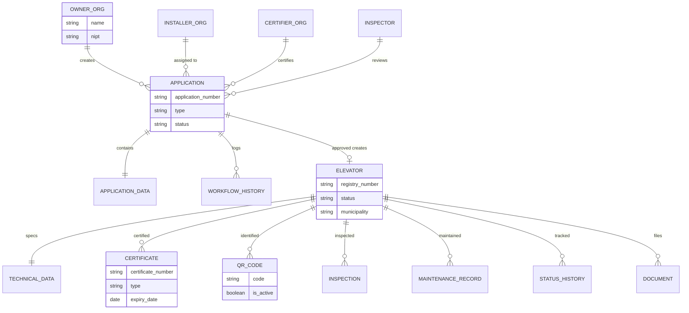
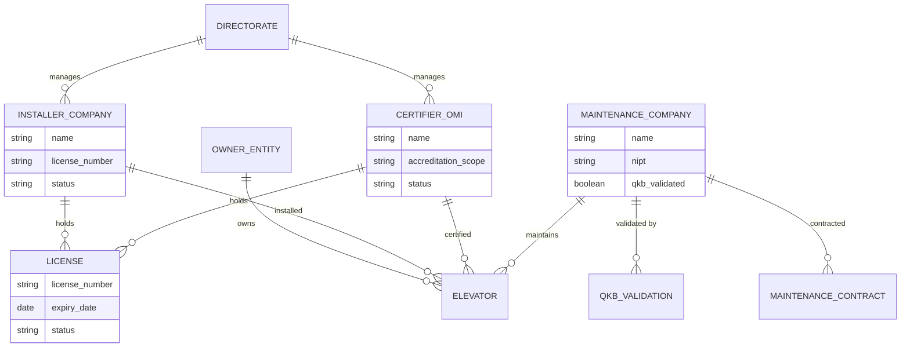

# Entity Relationship Diagram

## 1. Full System ERD

```mermaid
erDiagram
    AUTH_USERS ||--o{ ORG_MEMBERSHIPS : "belongs to"
    AUTH_ROLES ||--o{ ORG_MEMBERSHIPS : "has role"
    AUTH_ROLES ||--o{ AUTH_ROLE_PERMISSIONS : "grants"
    AUTH_PERMISSIONS ||--o{ AUTH_ROLE_PERMISSIONS : "assigned to"

    ORG_ORGANIZATIONS ||--o{ ORG_MEMBERSHIPS : "has members"
    ORG_ORGANIZATIONS ||--o{ ORG_LICENSES : "holds"
    ORG_ORGANIZATIONS ||--o{ ORG_QKB_VALIDATIONS : "validated by"

    AUTH_USERS ||--o{ APP_APPLICATIONS : "creates"
    ORG_ORGANIZATIONS ||--o{ APP_APPLICATIONS : "owner"
    ORG_ORGANIZATIONS ||--o{ APP_APPLICATIONS : "installer"
    ORG_ORGANIZATIONS ||--o{ APP_APPLICATIONS : "certifier"
    AUTH_USERS ||--o{ APP_APPLICATIONS : "inspector"

    APP_APPLICATIONS ||--|| APP_APPLICATION_DATA : "contains"
    APP_APPLICATIONS ||--o{ APP_WORKFLOW_HISTORY : "tracks"
    APP_APPLICATIONS ||--o| ELV_ELEVATORS : "creates on approval"

    ELV_ELEVATORS ||--|| ELV_TECHNICAL_DATA : "has"
    ELV_ELEVATORS ||--o{ ELV_RESPONSIBLE_ENTITIES : "assigned"
    ELV_ELEVATORS ||--o{ ELV_STATUS_HISTORY : "tracks"
    ELV_ELEVATORS ||--o{ CERT_CERTIFICATES : "holds"
    ELV_ELEVATORS ||--o{ QR_CODES : "identified by"
    ELV_ELEVATORS ||--o{ MAINT_RECORDS : "maintained"
    ELV_ELEVATORS ||--o{ MAINT_CONTRACTS : "contracted"
    ELV_ELEVATORS ||--o{ INSP_INSPECTIONS : "inspected"
    ELV_ELEVATORS ||--o{ CIT_REPORTS : "reported on"
    ELV_ELEVATORS ||--o| MAINT_COMPLIANCE_STATUS : "compliance"

    ORG_ORGANIZATIONS ||--o{ ELV_RESPONSIBLE_ENTITIES : "responsible"
    ORG_ORGANIZATIONS ||--o{ MAINT_CONTRACTS : "maintains"
    ORG_ORGANIZATIONS ||--o{ MAINT_RECORDS : "performs"
    ORG_ORGANIZATIONS ||--o{ CERT_CERTIFICATES : "issues"

    QR_CODES ||--o{ QR_SCAN_LOGS : "scanned"

    INSP_INSPECTIONS ||--o| CERT_CERTIFICATES : "generates"
    AUTH_USERS ||--o{ INSP_INSPECTIONS : "conducts"

    DOC_DOCUMENTS ||--o{ DOC_DOCUMENT_LINKS : "linked to"
    DOC_DOCUMENTS ||--o{ DOC_ACCESS_LOG : "accessed"
    AUTH_USERS ||--o{ DOC_DOCUMENTS : "uploads"
    AUTH_USERS ||--o{ DOC_ACCESS_LOG : "accesses"

    CIT_REPORTS ||--o{ CIT_REPORT_ACTIONS : "actions"
    AUTH_USERS ||--o{ CIT_REPORTS : "reports"
    AUTH_USERS ||--o{ CIT_REPORT_ACTIONS : "acts on"

    MIG_BATCHES ||--o{ MIG_STAGING_RECORDS : "contains"
    MIG_BATCHES ||--o{ ELV_ELEVATORS : "imports"
    MIG_STAGING_RECORDS ||--o| ELV_ELEVATORS : "becomes"

    AUTH_USERS ||--o{ SYS_NOTIFICATIONS : "receives"
    AUTH_USERS ||--o{ AUDIT_LOGS : "performs"

    AUTH_USERS {
        uuid id PK
        varchar email UK
        varchar password_hash
        varchar first_name
        varchar last_name
        varchar nid UK
        boolean is_active
        timestamptz created_at
        timestamptz deleted_at
    }

    AUTH_ROLES {
        uuid id PK
        varchar code UK
        varchar name
    }

    ORG_ORGANIZATIONS {
        uuid id PK
        org_type type
        varchar name
        varchar nipt UK
        varchar municipality
        org_status status
        boolean qkb_validated
        timestamptz deleted_at
    }

    ORG_MEMBERSHIPS {
        uuid id PK
        uuid user_id FK
        uuid organization_id FK
        uuid role_id FK
        boolean is_primary
    }

    ORG_LICENSES {
        uuid id PK
        uuid organization_id FK
        varchar license_number
        date expiry_date
        org_status status
    }

    APP_APPLICATIONS {
        uuid id PK
        varchar application_number UK
        app_type type
        app_status status
        uuid owner_org_id FK
        uuid installer_org_id FK
        uuid certifier_org_id FK
        uuid elevator_id FK
        uuid assigned_inspector_id FK
        timestamptz submitted_at
        timestamptz approved_at
    }

    APP_APPLICATION_DATA {
        uuid id PK
        uuid application_id FK
        text building_address
        varchar building_municipality
        elv_type elevator_type
        varchar manufacturer
        varchar serial_number
        jsonb correction_fields
        jsonb update_fields
    }

    APP_WORKFLOW_HISTORY {
        uuid id PK
        uuid application_id FK
        app_status from_status
        app_status to_status
        uuid actor_id FK
        timestamptz created_at
    }

    ELV_ELEVATORS {
        uuid id PK
        varchar registry_number UK
        uuid application_id FK
        elv_status status
        uuid owner_org_id FK
        uuid installer_org_id FK
        uuid certifier_org_id FK
        uuid maintenance_org_id FK
        text building_address
        varchar building_municipality
        date registration_date
        uuid migration_batch_id FK
    }

    ELV_TECHNICAL_DATA {
        uuid id PK
        uuid elevator_id FK
        elv_type elevator_type
        varchar manufacturer
        varchar serial_number
        integer floors_served
        jsonb additional_data
    }

    ELV_RESPONSIBLE_ENTITIES {
        uuid id PK
        uuid elevator_id FK
        uuid organization_id FK
        org_type role
        date valid_from
        date valid_to
    }

    ELV_STATUS_HISTORY {
        uuid id PK
        uuid elevator_id FK
        elv_status from_status
        elv_status to_status
        uuid actor_id FK
        uuid application_id FK
    }

    CERT_CERTIFICATES {
        uuid id PK
        varchar certificate_number UK
        uuid elevator_id FK
        cert_type type
        cert_status status
        date issued_date
        date expiry_date
        uuid document_id FK
    }

    QR_CODES {
        uuid id PK
        uuid elevator_id FK
        varchar code UK
        boolean is_active
        integer scan_count
    }

    MAINT_CONTRACTS {
        uuid id PK
        uuid elevator_id FK
        uuid maintenance_org_id FK
        date start_date
        date end_date
        boolean is_active
    }

    MAINT_RECORDS {
        uuid id PK
        uuid elevator_id FK
        uuid maintenance_org_id FK
        maint_type type
        date performed_date
        text findings
    }

    MAINT_COMPLIANCE_STATUS {
        uuid id PK
        uuid elevator_id FK
        date last_maintenance_date
        boolean is_compliant
        integer days_overdue
    }

    INSP_INSPECTIONS {
        uuid id PK
        uuid elevator_id FK
        uuid inspector_id FK
        insp_type type
        insp_result result
        date scheduled_date
        date conducted_date
        date next_inspection_date
    }

    DOC_DOCUMENTS {
        uuid id PK
        varchar filename
        varchar mime_type
        bigint file_size
        varchar storage_path
        varchar checksum_sha256
        doc_classification classification
        uuid uploaded_by FK
    }

    DOC_DOCUMENT_LINKS {
        uuid id PK
        uuid document_id FK
        varchar entity_type
        uuid entity_id
    }

    CIT_REPORTS {
        uuid id PK
        varchar report_number UK
        cit_report_type type
        cit_report_status status
        uuid reporter_user_id FK
        uuid elevator_id FK
        text description
        varchar priority
        uuid assigned_inspector_id FK
    }

    MIG_BATCHES {
        uuid id PK
        varchar batch_number UK
        mig_batch_status status
        integer total_rows
        integer imported_rows
        jsonb mapping_config
    }

    MIG_STAGING_RECORDS {
        uuid id PK
        uuid batch_id FK
        integer row_number
        jsonb raw_data
        jsonb mapped_data
        varchar validation_status
        uuid elevator_id FK
    }

    AUDIT_LOGS {
        uuid id PK
        uuid actor_id FK
        audit_action action
        varchar entity_type
        uuid entity_id
        jsonb before_state
        jsonb after_state
        uuid correlation_id
        timestamptz created_at
    }

    SYS_NOTIFICATIONS {
        uuid id PK
        uuid user_id FK
        notif_channel channel
        varchar title
        text body
        timestamptz read_at
    }
```

## 2. Core Domain ERD (Simplified)

Focus on the central business flow: Application → Elevator → Compliance.

## 3. Organization Relationship ERD

## 4. Cardinality Reference

| Relationship | Cardinality | Notes |
|-------------|-------------|-------|
| User → Organization | M:N | Via memberships; user can belong to multiple orgs |
| Application → Elevator | 1:0..1 | Only NEW_REGISTRATION creates elevator |
| Elevator → Application | 1:1 | Every elevator has exactly one originating application |
| Elevator → QR Code | 1:N | Historical QR codes; only one active at a time |
| Elevator → Certificate | 1:N | Multiple certificates over lifetime |
| Elevator → Inspection | 1:N | Recurring inspections |
| Elevator → Maintenance Record | 1:N | Ongoing maintenance logs |
| Organization → License | 1:N | Installer/OMI can have license history |
| Document → Entity | N:M | Via document_links polymorphic table |
| Migration Batch → Elevator | 1:N | Batch import creates multiple elevators |
| Application → Workflow History | 1:N | Every transition logged |

## 5. Polymorphic Relationships

### Document Links
`doc_document_links` uses `entity_type` + `entity_id` to link documents to:
- `application` → app_applications.id
- `elevator` → elv_elevators.id
- `inspection` → insp_inspections.id
- `maintenance` → maint_records.id
- `certificate` → cert_certificates.id
- `citizen_report` → cit_reports.id
- `organization` → org_organizations.id

### Audit Logs
`audit_logs` uses `entity_type` + `entity_id` to reference any auditable entity.

### Notifications
`sys_notifications` uses `entity_type` + `entity_id` for deep-linking to relevant records.
