# Workflow Diagrams

## 1. Application Lifecycle Diagram

The application is the gateway to all elevator registry changes.

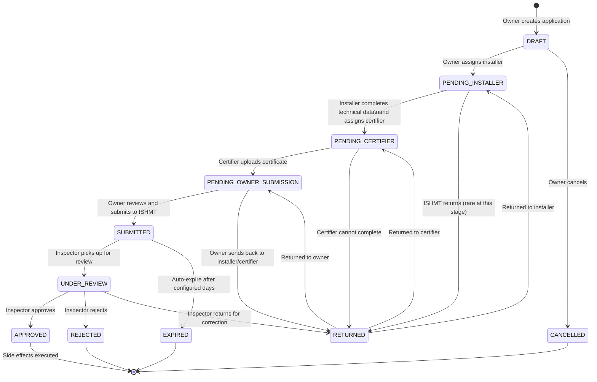

### Application Type Variations

| Type | Workflow Differences |
|------|---------------------|
| NEW_REGISTRATION | Full workflow above; creates elevator on approval |
| DEREGISTRATION | Owner creates → submits → ISHMT reviews → approval changes elevator status |
| DATA_CORRECTION | Owner creates with field corrections → submits → ISHMT reviews → approval applies corrections |
| DATA_UPDATE | Owner creates with field updates → may require supporting documents → ISHMT reviews → approval applies updates |

## 2. Elevator Lifecycle Diagram

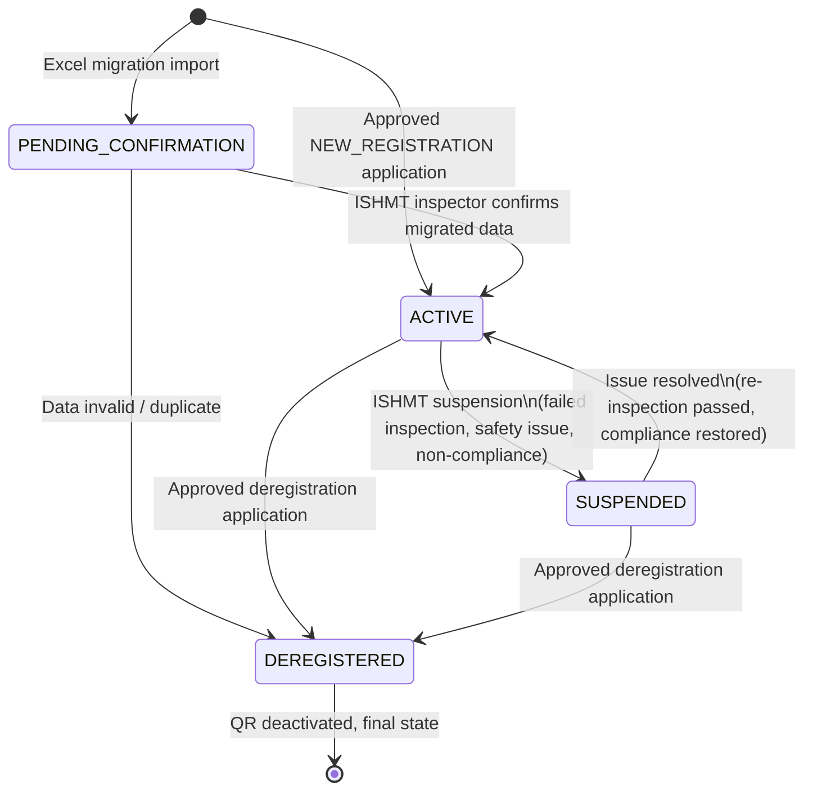

### Elevator Lifecycle Events

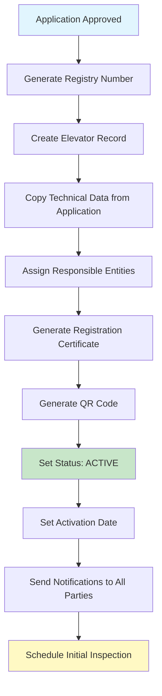

## 3. Registration Workflow (Complete)

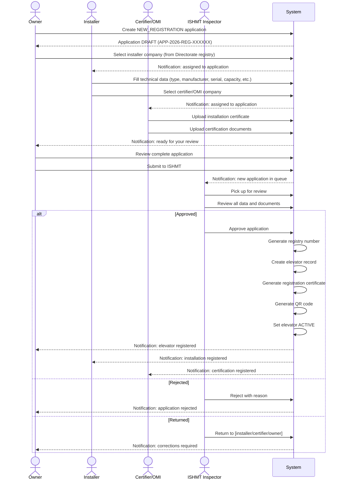

## 4. Deregistration Workflow

```mermaid
flowchart TD
    A[Owner identifies elevator for deregistration] --> B[Create DEREGISTRATION application]
    B --> C[Provide deregistration reason\n(demolished, replaced, building demolished, other)]
    C --> D[Upload supporting documents if required]
    D --> E[Submit to ISHMT]

    E --> F{ISHMT Inspector Review}
    F -->|Approve| G[Elevator status → DEREGISTERED]
    G --> H[Set deregistration_date]
    H --> I[Deactivate QR code]
    I --> J[Revoke active certificates]
    J --> K[Close maintenance contracts]
    K --> L[Record in status history]
    L --> M[Notify owner and parties]

    F -->|Reject| N[Application REJECTED with reason]
    N --> O[Notify owner]

    F -->|Return| P[Return to owner for additional info]
    P --> D

    style G fill:#ffcdd2
    style M fill:#c8e6c9
```

## 5. Data Correction Workflow

For fixing **erroneous** data in the registry (data was wrong at time of registration).

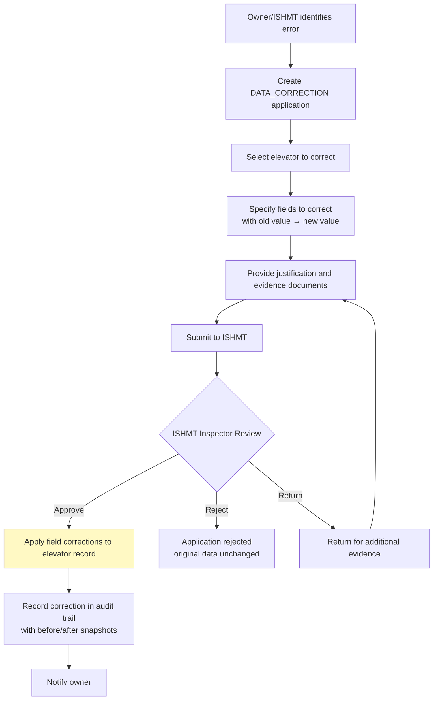

**Correctable fields:** building address, technical specifications, responsible entity assignments (with evidence).

## 6. Data Update Workflow

For **legitimate changes** to registered data (owner transfer, maintenance company change, address change due to municipality reorganization).

```mermaid
flowchart TD
    A[Change event occurs] --> B{Who initiates?}
    B -->|Owner| C[Create DATA_UPDATE application]
    B -->|ISHMT| D[ISHMT creates on behalf of owner]

    C --> E[Select elevator]
    D --> E
    E --> F[Specify update type]
    F --> G{Update Type}

    G -->|Owner Transfer| H[New owner organization details\n+ transfer document]
    G -->|Maintenance Company Change| I[New maintenance company\n(must be QKB validated)\n+ new contract]
    G -->|Address Change| J[New address details\n+ supporting document]
    G -->|Other| K[Specify fields and justification]

    H --> L[Submit to ISHMT]
    I --> L
    J --> L
    K --> L

    L --> M{ISHMT Review}
    M -->|Approve| N[Apply updates to elevator]
    N --> O[Update responsible entities\nwith validity periods]
    O --> P[Record in audit trail]
    P --> Q[Notify all affected parties]

    M -->|Reject| R[Reject with reason]
    M -->|Return| S[Return for more info]

    style N fill:#c8e6c9
```

## 7. Maintenance Workflow

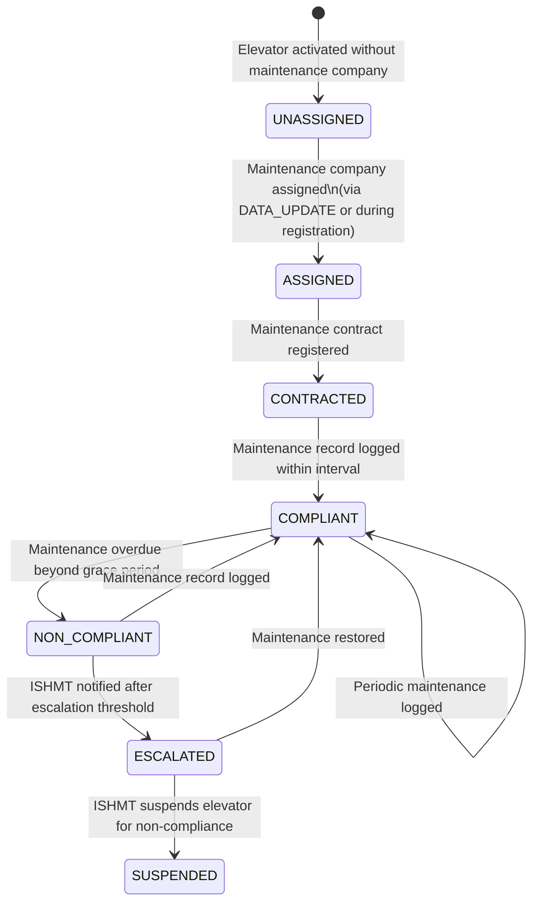

### Maintenance Record Flow

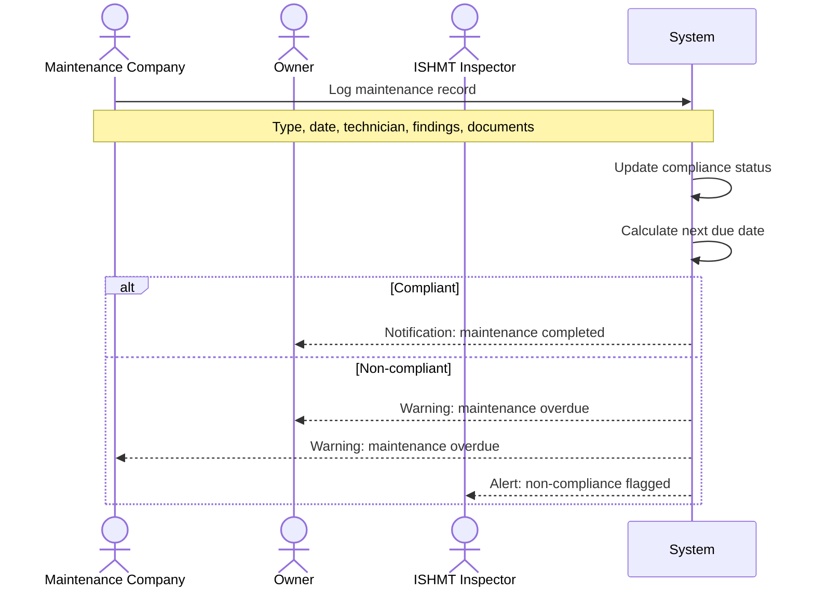

## 8. Inspection Workflow

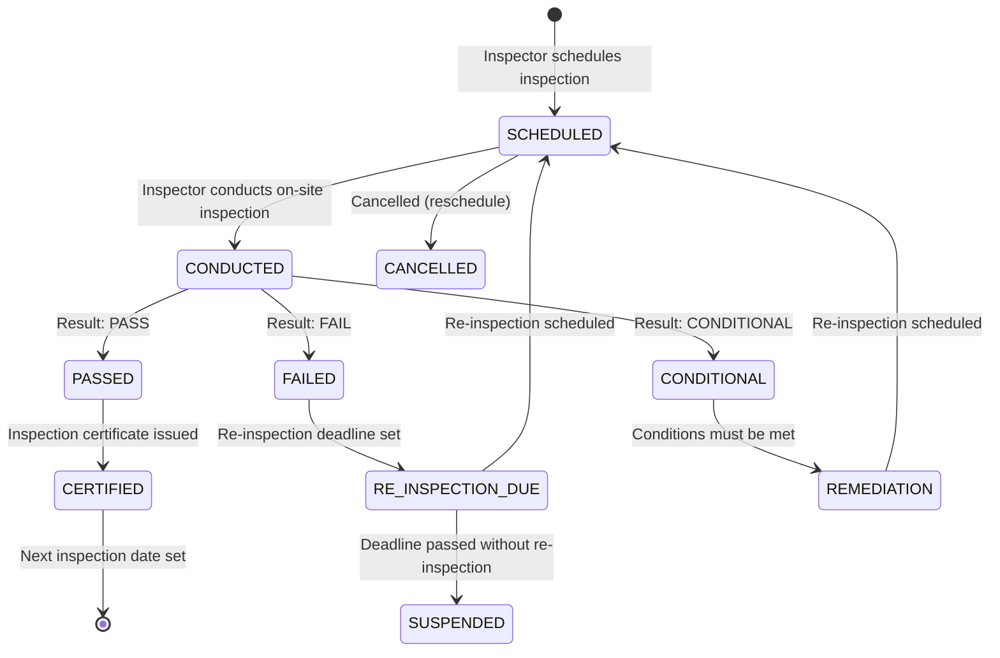

### Inspection Sequence

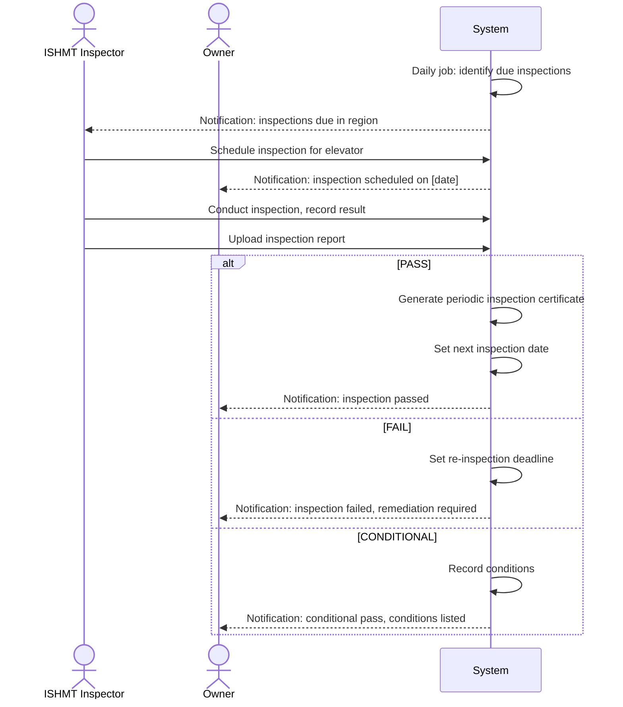

## 9. QR Code Workflow

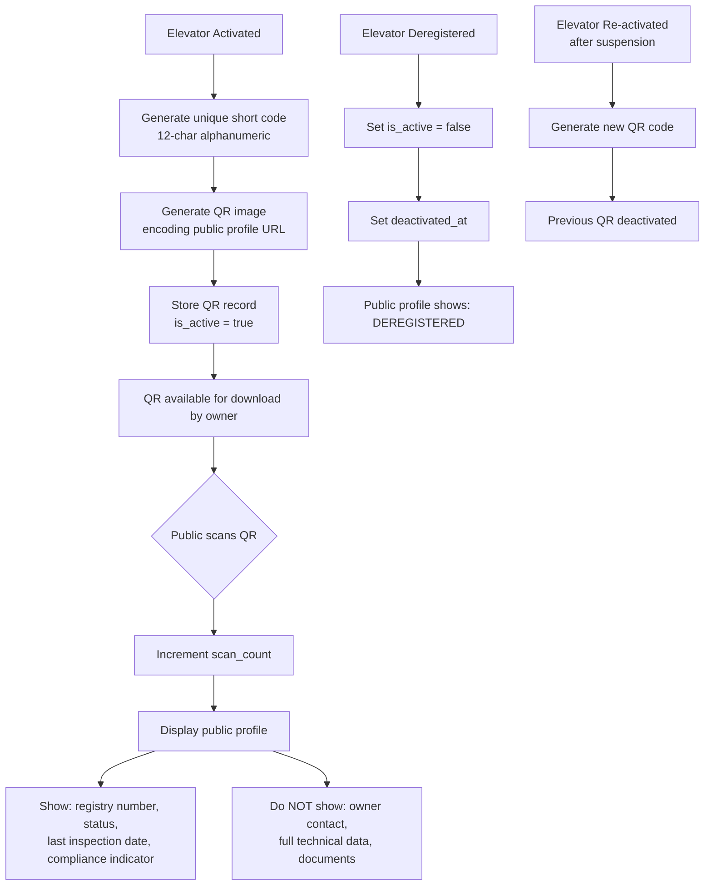

## 10. Citizen Reporting Workflow

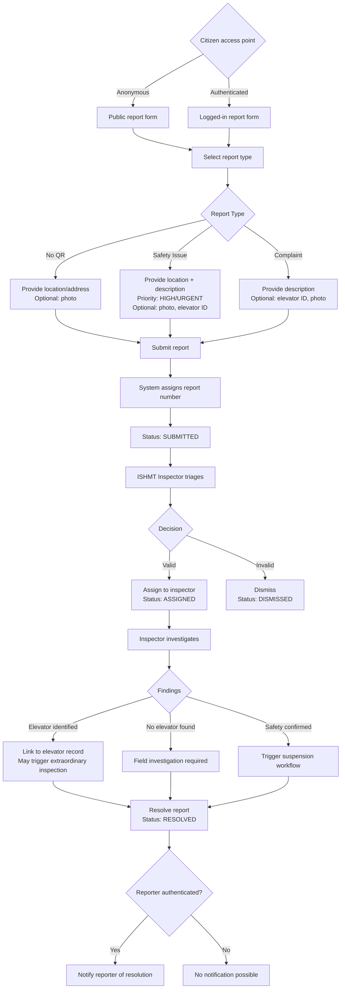

## 11. Excel Migration Workflow

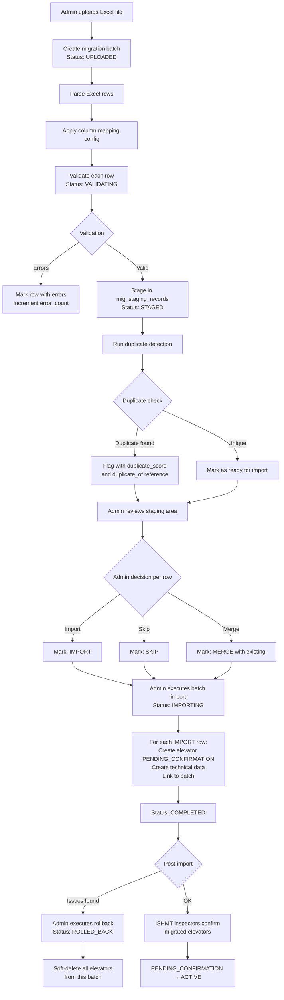

## 12. QKB Validation Workflow (Phase 2)

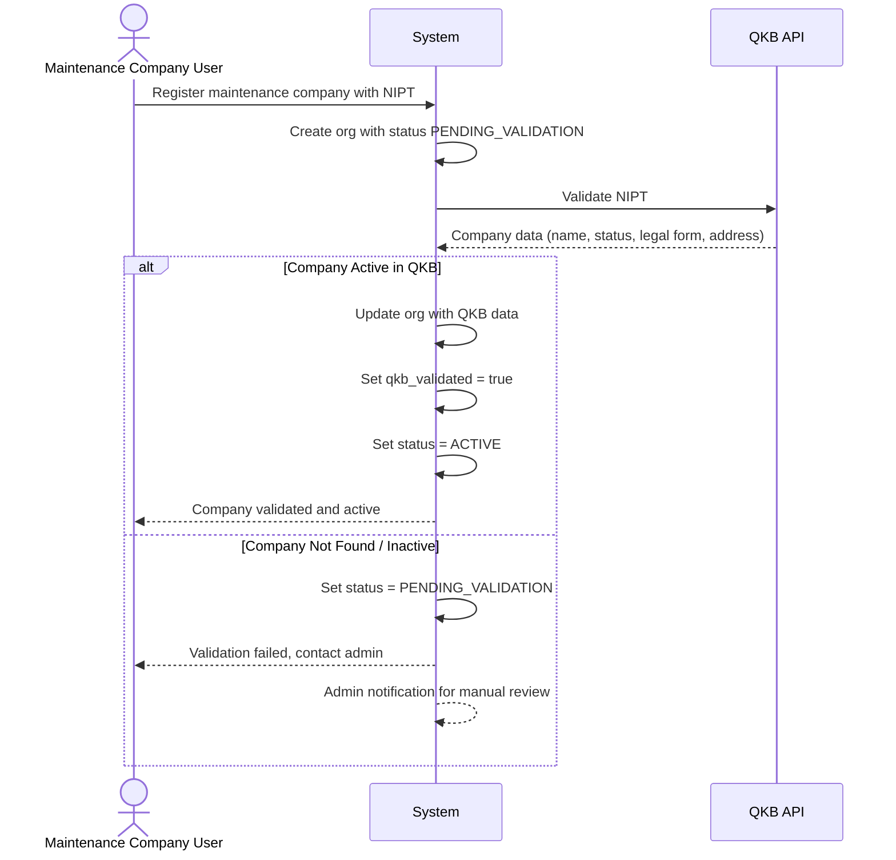

**Phase 1 fallback:** Manual NIPT entry with admin verification flag.
